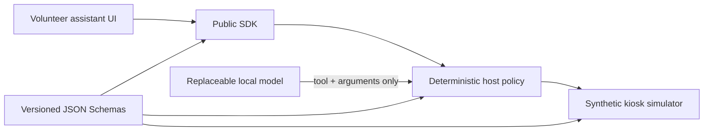

# SARA Local Assistant SDK

Experimental tools for volunteers building a small, on-device assistant for SARA kiosk tablets.

This repository is deliberately separated from the production SARA system. It contains model-neutral contracts, a synthetic kiosk simulator, example assistant skills, client SDKs, and evaluation fixtures. It contains no production credentials, patient records, fleet administration interface, or live SARA backend access.

The research scope includes the full range of local-assistant capabilities: diagnostic reasoning, treatment and dosage decision support, triage, and emergency-workflow simulation. Contributors are encouraged to test ambitious approaches with synthetic cases, explicit ground truth, reproducible metrics, and structured uncertainty. Connecting a research capability to production is a separate adapter and release decision.

עברית: [README.he.md](README.he.md)

## What volunteers can build

- Hebrew and English intent routing and tool-selection evaluations.
- Adapters for small local-model runtimes.
- Accessible assistant experiences that consume the public contracts.
- Read-only assistant skills and deterministic summaries.
- Clinical-reasoning, treatment, dosage, triage, and emergency-workflow research on synthetic cases.
- Performance benchmarks on representative Android tablet classes.

The initial catalog exposes six bounded tools:

| Tool | Purpose | Effect |
|---|---|---|
| `system.get_context` | Read the synthetic kiosk context | Read |
| `ui.open` | Request navigation to an allowlisted screen | Navigate |
| `vitals.get_latest` | Read bounded synthetic measurements | Read |
| `vitals.get_trend_summary` | Read a deterministic synthetic trend summary | Read |
| `device.get_summary` | Read a synthetic device-readiness summary | Read |
| `help.explain_screen` | Explain an allowlisted screen | Read |

## Quick start

Requirements: Node.js 22 or newer.

```bash
npm ci
npm test
npm run simulator
```

In another terminal:

```bash
npm run sample
```

The simulator binds only to `127.0.0.1` and returns synthetic data.

## Architecture



The model proposes intent. Trusted host code validates the schema, capability, risk, deadline, and result. Model output is never treated as authorization.

Start with:

- [Architecture](docs/architecture.md)
- [Security boundary](docs/security-boundary.md)
- [Building a skill](docs/building-a-skill.md)
- [API versioning](docs/api-versioning.md)
- [Model runtime interface](docs/model-runtime.md)

## Repository status

The contracts are experimental and may change before `1.0.0`. Production integration remains private and is intentionally outside this repository. See [ROADMAP.md](ROADMAP.md) for staged milestones.

## Contributing

Read [CONTRIBUTING.md](CONTRIBUTING.md) and [SECURITY.md](SECURITY.md) before opening a pull request. Use only synthetic data in code, tests, screenshots, issues, and discussions.

Licensed under [Apache License 2.0](LICENSE).
