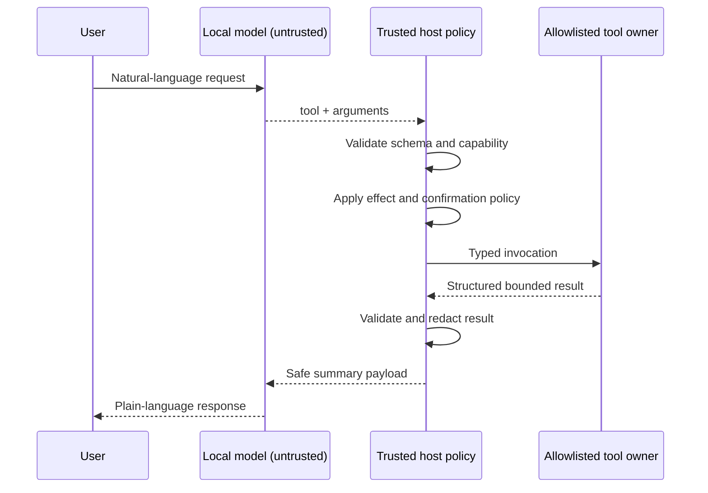

# Architecture

## Purpose

The SDK lets volunteers work on an on-device assistant without receiving access to the production SARA system. The public boundary is a small, versioned tool catalog plus a deterministic simulator.

## Trust model

The model does not supply identity, role, consent, capability, confirmation, or transport details. Those facts come from trusted host state and are recomputed for each invocation.

## Components

- `contracts/`: source of truth for tool definitions, proposals, capabilities, and results.
- `skills/`: short assistant workflows that select from a small tool subset.
- `sdk/javascript/`: reference client for structured invocation.
- `sdk/kotlin/`: Android/JVM-friendly contract API and transport interface.
- `simulator/mock-kiosk/`: loopback-only runtime with synthetic fixtures.
- `evals/`: non-sensitive Hebrew and English routing fixtures.
- `tests/`: contract, policy, simulator, SDK, skill, and boundary checks.

## Production integration

Production integration is intentionally not part of this repository. A private adapter may implement these public contracts against stable SARA owners, but internal implementation names, network details, device administration, and user identifiers must not cross the boundary.

## Design constraints

- Model runtime is replaceable.
- Automatic tool execution is disabled.
- Every input and output is schema-validated.
- Tools are capability-gated and fail closed.
- Results are bounded and do not include free-form HTML.
- Read-only and navigation effects are the only effects in the initial catalog.
- Logs contain metadata only, never prompts, arguments, measurements, or response text.
